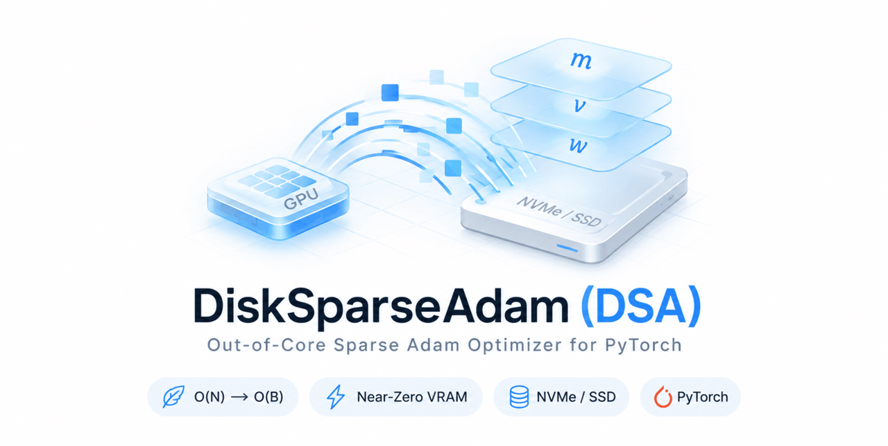

# DiskSparseAdam (DSA)

[](https://www.python.org/downloads/)
[](https://pytorch.org/)
[](https://opensource.org/licenses/MIT)
<a href="https://doi.org/10.5281/zenodo.21296366"></a>

<p align="center">
  
</p>

**DiskSparseAdam (DSA)** is a drop-in Out-of-Core Sparse Adam optimizer for PyTorch. It reduces optimizer memory footprint from $\mathcal{O}(N)$ to $\mathcal{O}(B)$, enabling the training of billion-scale graph embeddings and Knowledge Graph representations on **consumer-grade GPUs and workstations**, as well as cloud environments like **Kaggle** and **Google Colab**.

---

## 🚀 Key Features

* **Near-Zero VRAM Overhead:** Optimizer momentum ($m$) and variance ($v$) states reside on NVMe/SSD storage via `np.memmap`. Only active batch parameters $\mathcal{O}(B)$ are loaded into GPU memory.
* **Non-Blocking Async I/O:** Utilizes a background worker thread with double-buffering (`AsyncDiskWriter`) to flush state updates to disk asynchronously without stalling GPU computations.
* **Safe Duplicate Aggregation:** Automatically aggregates duplicate node/entity indices (hub nodes) appearing within the same batch via `torch.unique` and `index_add_`.
* **Riemannian & Euclidean Support:** Supports Riemannian gradient scaling and Poincaré Ball retraction ($k > 0$) for Hyperbolic embeddings, as well as standard Euclidean Adam ($k = 0.0$).
* **Cross-Platform:** Runs seamlessly on local Linux/Windows GPU machines, workstations, and cloud notebooks.

---

## 📊 Benchmark Results

Tested on a dataset of **1,000,000 entities** (128-dim vectors, ~1.46 GB total states on disk):

| Metric | Result |
| :--- | :--- |
| **GPU VRAM Overhead** | **0.00 MB** (Optimizer states stay on disk) |
| **Throughput** | **~134,000+ samples / second** |
| **Convergence** | Verified Loss reduction on synthetic & real graph tasks |
| **Duplicate Nodes** | Safe automatic aggregation via `index_add_` |

---

## 📦 Installation

### Online Installation
```bash
pip install git+https://github.com/Assistentus/DSA.git
```

### Editable Local Mode
```bash
git clone https://github.com/Assistentus/DSA.git
cd DSA
pip install -e .
```

---

## 💻 1. Local Machine / Workstation Example

This example demonstrates the exact PyTorch Autograd workflow for local GPU/CPU execution:

```python
import os
import shutil
import torch
from dsa.optimizer import DiskSparseRiemannianAdam

# 1. Device Setup
device = torch.device("cuda" if torch.cuda.is_available() else "cpu")
cache_dir = "./dsa_local_cache"

if os.path.exists(cache_dir):
    shutil.rmtree(cache_dir)

# 2. Define Dataset & Parameters (e.g., 100,000 entities)
num_entities = 100_000
dim = 64
batch_size = 1024

# Initial weights in RAM
initial_weights = torch.randn(num_entities, dim) * 0.1
params = {"entity_emb": initial_weights}

# 3. Initialize Optimizer (k=0.0 for standard Euclidean Adam)
optimizer = DiskSparseRiemannianAdam(
    params=params,
    lr=0.01,
    k=0.0,
    disk_dir=cache_dir
)

# Target vectors to converge towards
target_embeddings = torch.randn(num_entities, dim) * 0.1

print("🚀 Starting local training loop...")

# 4. Training Loop
for epoch in range(1, 101):
    indices = torch.randint(0, num_entities, (batch_size,))
    idx_np = indices.numpy()
    
    # Read current weights directly from DSA disk memmap
    vec_np = optimizer.state_files["entity_emb"]["w"][idx_np].copy()
    vec = torch.from_numpy(vec_np).to(device).requires_grad_(True)
    
    # Compute Loss (MSE against target)
    target_vec = target_embeddings[indices].to(device)
    loss = torch.mean((vec - target_vec) ** 2)
    
    # Compute gradients via PyTorch autograd
    loss.backward()
    
    # Pass explicit indices and gradients to DSA
    optimizer.step(updates={"entity_emb": (indices, vec.grad.cpu())})

# 5. Flush background writer thread to disk
optimizer.shutdown()
print(f"✅ Training complete. Final Loss: {loss.item():.4f}")

# Clean up local cache
shutil.rmtree(cache_dir)
```

---

## 🏆 2. Kaggle & Cloud Notebooks Example
[](https://www.kaggle.com/datasets/assistentus/disk-sparse-adam)

In a **Kaggle Notebook**, VRAM and RAM are strictly capped (~15 GB VRAM, ~13–30 GB RAM). `DiskSparseAdam` offloads optimizer states onto Kaggle's fast `/kaggle/working` NVMe disk, completely bypassing VRAM limitations.

### Installation in Kaggle Notebooks
```python
# Cell 1: Install directly from GitHub
!pip install -q git+https://github.com/Assistentus/DSA.git
```

### Full Kaggle Notebook Integration Code
```python
import os
import shutil
import torch
from dsa.optimizer import DiskSparseRiemannianAdam

# 1. Device Setup
device = torch.device("cuda" if torch.cuda.is_available() else "cpu")

# 2. Configure Kaggle Working Disk Directory
KAGGLE_CACHE_DIR = "/kaggle/working/dsa_optimizer_cache"
os.makedirs(KAGGLE_CACHE_DIR, exist_ok=True)

num_entities = 1_000_000
dim = 128
batch_size = 2048

# Initialize embeddings
embeddings = torch.randn(num_entities, dim) * 0.01

# 3. Initialize DiskSparseRiemannianAdam
optimizer = DiskSparseRiemannianAdam(
    params={"entity_emb": embeddings},
    lr=0.001,
    k=0.0,
    disk_dir=KAGGLE_CACHE_DIR,
    max_queue_size=300
)

print("🚀 Starting training on Kaggle...")

# 4. Training Loop
for epoch in range(1, 11):
    indices = torch.randint(0, num_entities, (batch_size,))
    idx_np = indices.numpy()
    
    # Fetch weights from DSA disk cache
    vec_np = optimizer.state_files["entity_emb"]["w"][idx_np].copy()
    vec = torch.from_numpy(vec_np).to(device).requires_grad_(True)
    
    # Compute Loss
    loss = (vec ** 2).sum()
    loss.backward()
    
    # Apply step on disk
    optimizer.step(updates={"entity_emb": (indices, vec.grad.cpu())})

# 5. Shutdown & Clean disk
optimizer.shutdown()

if os.path.exists(KAGGLE_CACHE_DIR):
    shutil.rmtree(KAGGLE_CACHE_DIR)
    print("🧹 Disk cache cleaned.")
```

---

## 🌌 3. Hyperbolic Poincaré Ball Workflow ($k > 0$)

For Hyperbolic Knowledge Graph Embeddings (e.g., Poincaré embeddings, RotatE in hyperbolic space), set the curvature parameter `k > 0.0`:

```python
# Set k=1.0 for Poincaré Ball Conformal Gradient Scaling & Retraction
optimizer = DiskSparseRiemannianAdam(
    params={"hyperbolic_nodes": initial_weights},
    lr=0.001,
    k=1.0,  # Hyperbolic mode
    disk_dir="./hyperbolic_cache"
)

# The optimizer automatically applies Riemannian scaling and retraction during step()
optimizer.step(updates={"hyperbolic_nodes": (indices, gradients)})
```

---

## 📖 API Reference

### `DiskSparseRiemannianAdam`

```python
from dsa.optimizer import DiskSparseRiemannianAdam

optimizer = DiskSparseRiemannianAdam(
    params,
    lr=1e-3,
    beta1=0.9,
    beta2=0.999,
    eps=1e-8,
    weight_decay=0.0,
    k=1.0,
    disk_dir="./disk_cache",
    max_queue_size=150
)
```

#### Parameters:
* **`params`** (*dict* or *list*): Dictionary of `{"param_name": torch.Tensor}` or a list of tensors to optimize.
* **`lr`** (*float*, optional): Learning rate (default: `1e-3`).
* **`beta1`, `beta2`** (*float*, optional): Coefficients for computing running averages of the gradient and its square (default: `0.9`, `0.999`).
* **`eps`** (*float*, optional): Term added to the denominator for numerical stability (default: `1e-8`).
* **`weight_decay`** (*float*, optional): Weight decay coefficient (default: `0.0`).
* **`k`** (*float*, optional): Poincaré Ball curvature parameter ($k > 0$ for Hyperbolic, $k = 0$ for Euclidean) (default: `1.0`).
* **`disk_dir`** (*str*, optional): Directory path where `np.memmap` files (`_w.dat`, `_m.dat`, `_v.dat`) will be created (default: `"./disk_cache"`).
* **`max_queue_size`** (*int*, optional): Maximum capacity of the background I/O queue (default: `150`).

#### Methods:
* **`step(updates, current_k=None)`**: Performs a single optimization step. 
  * `updates` (*dict*): Dictionary mapping `param_name` to a tuple `(indices_tensor, grads_tensor)`.
  * `current_k` (*float* or *Tensor*, optional): Dynamic curvature $k$ override.
* **`shutdown()`**: Flushes pending write operations to disk and safely terminates the background writer thread. Must be called at the end of the training process.

---

## 🛠️ Best Practices & Troubleshooting

1. **Always call `optimizer.shutdown()`**: Because `AsyncDiskWriter` runs on a background daemon thread, call `.shutdown()` at the end of training to ensure all memory-mapped buffers flush to disk properly.
2. **Disk Space Limit**: Ensure your NVMe drive has enough space for 3 arrays per parameter (`_w.dat`, `_m.dat`, `_v.dat` float32 arrays). For 1M entities with 128 dimensions, this takes ~1.5 GB.
3. **Queue Overflow Warning**: If you see `⚠️ Disk queue full`, your disk write speed is slower than batch submission. Increase `max_queue_size=300` or add compute time on GPU (forward/backward passes naturally solve this).

---

## 📄 License

This project is licensed under the MIT License.

```text
MIT License

Copyright (c) 2024 Maksim Khotinsky

Permission is hereby granted, free of charge, to any person obtaining a copy
of this software and associated documentation files (the "Software"), to deal
in the Software without restriction, including without limitation the rights
to use, copy, modify, merge, publish, distribute, sublicense, and/or sell
copies of the Software, and to permit persons to whom the Software is
furnished to do so, subject to the following conditions:

The above copyright notice and this permission notice shall be included in all
copies or substantial portions of the Software.

THE SOFTWARE IS PROVIDED "AS IS", WITHOUT WARRANTY OF ANY KIND, EXPRESS OR
IMPLIED, INCLUDING BUT NOT LIMITED TO THE WARRANTIES OF MERCHANTABILITY,
FITNESS FOR A PARTICULAR PURPOSE AND NONINFRINGEMENT. IN NO EVENT SHALL THE
AUTHORS OR COPYRIGHT HOLDERS BE LIABLE FOR ANY CLAIM, DAMAGES OR OTHER
LIABILITY, WHETHER IN AN ACTION OF CONTRACT, TORT OR OTHERWISE, ARISING FROM,
OUT OF OR IN CONNECTION WITH THE SOFTWARE OR THE USE OR OTHER DEALINGS IN THE
SOFTWARE.
```

---

## 📚 Citations

If you use this software in your research, please cite it using the following DOI:

**APA:**
> Khotinsky, M. (2024). DiskSparseAdam (DSA): Out-of-Core Sparse Adam Optimizer. Zenodo. https://doi.org/10.5281/zenodo.21296366

**BibTeX:**
```bibtex
@software{khotinsky_dsa,
  author       = {Maksim Khotinsky},
  title        = {DiskSparseAdam (DSA): Out-of-Core Sparse Adam Optimizer},
  publisher    = {Zenodo},
  doi          = {10.5281/zenodo.21296366},
  url          = {https://doi.org/10.5281/zenodo.21296366}
}
```
